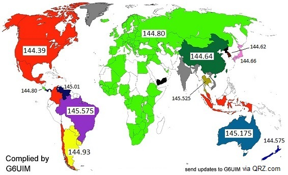

# APRS General Reference <!-- omit from toc -->

Automatic Packet Reporting System

## Table of Contents <!-- omit from toc -->

- [History of APRS](#history-of-aprs)
- [Key facts](#key-facts)
- [Operating APRS in an Emergency](#operating-aprs-in-an-emergency)
- [APRS Bots and Auto Stations](#aprs-bots-and-auto-stations)
- [Standard SSID's](#standard-ssids)
- [APRS REFERNCE DOCUMENTATION](#aprs-refernce-documentation)

## History of APRS

🫡APRS was developed by Bob  Bruninga, WB4APR (SK)

APRS is digital communications information channel for Ham radio. As a single
national channel (see map at right), it gives the mobile ham a place to monitor
for 10 to 30 minutes in any area, at any time to capture what is happening in
ham radio in the surrounding area. Announcements, Bulletins, Messages, Alerts,
Weather, and of course a map of all this activity including objects,
frequencies, satellites, nets, meetings, Hamfests, etc.

*World map showing APRS frequencies*

**TODO:** Add some historical information regarding APRS

## Key facts

- Primary APRS frequency in Australia on 2m is 145.175 Mhz

## Operating APRS in an Emergency

In an emergency, there is the possiblility that the main APRS frequency will
become swamped.  You should build a comms plan that includes an alternate
frequency in the event the the primary frequency become too conjested. Note that
this aternate frequency will not have digipeaters and igates available unless
you make them part of your plan.

## APRS Bots and Auto Stations

| CallSign | Description | Operational Check |
|---|---|---|
| ANSRVR | Interest Groups | April 2024 |
| CQSRVR | Interest Groups | |
| MAIL | Store and Forward Messaging | Jan 2024 |
| MPAD | Email my position report | Mar 2024 |
| WLINK-1 | APRSLink to Winlink | Mar 2024 |
| AVRS | Automatic Voice Relay System | **Off-line** Apr 2024 |
| WHO-IS | Call Sign Lookup Service | **Off-line** Apr 2024 |

## Standard SSID's

The following a suggestion of standard SSIDs you can use to identify a station.
They are not a rule, only a guideline and you are free to use any SSID you wish.

A couple of instance where the design of this list is defective: \-7 for Kenwood
D7 Handheld is entirely shortsighted, \-4 for HF to VHF gateway is unecessary
and would only be used a few times globally.

- \-0 (No SSID) Home Station
- \-1 Digipeater, or Home Station running a Fill-In Digi,
- \-2 Digipeater [#2] on 70CM
- \-3 Digipeater [#3]
- \-4 HF to VHF Gateway
- \-5 IGate (Dedicated system, not home station)
- \-6 Operation via Satellite
- \-7 Kenwood D7 Handheld
- \-8 Secondary Mobile usage (also Maritime vessels)  (VHF / UHF)
- \-9 Mobiles (VHF / UHF)
- \-10 Operation via Internet Only (No RF capability)
- \-11 is for APRStouch-tone users (also high altitude balloons)
- \-12 Portable Units such as Laptops, Camp Sites etc
- \-13
- \-14 Interstate Truckers
- \-15 Operation via HF

## APRS REFERNCE DOCUMENTATION

[aprs.org](http://www.aprs.org)
 [^1]  
[aprs.queries.pdf](./Resources/APRS/aprs.queries.pdf) - List of APRS queries
and bots complied in 2018.  
[Bob Bruninga WB4APS SK - ARRL](https://web.archive.org/web/20240120042059/http://www.arrl.org/news/aprs-developer-bob-bruninga-wb4apr-sk)

[^1]: Icon use by permission and attribution to <www.flaticon.com>
