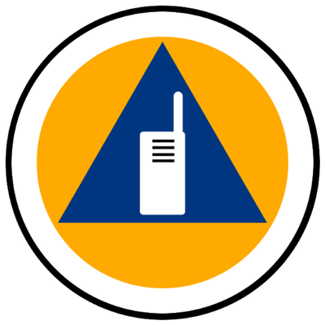

# 🦺 Emcomm Notes by Phil VK6DEV <!-- omit from toc -->

## Table of Contents <!-- omit from toc -->

- [Introduction](#introduction)
  - [What is EmComm?](#what-is-emcomm)
  - [Why do we need EmComm?](#why-do-we-need-emcomm)
  - [Who may need our assistance](#who-may-need-our-assistance)
- [Security Considerations](#security-considerations)
- [Information is King](#information-is-king)
- [Wireless Institute Civil Emergency Network WICEN](#wireless-institute-civil-emergency-network-wicen)
- [VK6DEV Comm Plan](#vk6dev-comm-plan)
- [Training](#training)
- [Tools](#tools)
- [Resources](#resources)
  - [Software Projects](#software-projects)
- [Reference Resources](#reference-resources)
  - [Emergency Services Radio](#emergency-services-radio)
  - [Martime Radio](#martime-radio)
  - [Citizens Band (CB) Radio](#citizens-band-cb-radio)
  - [AusTavel Safety Net](#austavel-safety-net)
  - [Useful Amateur Radio Frequencies](#useful-amateur-radio-frequencies)
  - [Band Plans](#band-plans)
  - [Emergency Management Agencies (Australia)](#emergency-management-agencies-australia)
- [Amatuer Radio Emergency Beacon Project](#amatuer-radio-emergency-beacon-project)
- [Useful Information during EmComm Event](#useful-information-during-emcomm-event)

## Introduction

This document is my work to investigate and document an emcomms methodology.
This EmComm plan is designed for my own use and as such will largely focus on
Western Australia 🇦🇺, but the concepts will be transferable to most locations.

This is a living document, it will change and grow over time so make sure you
come back regularly.

Collaboration is encouraged. These documents hosted on GitHub and editable by all.

Please feel free to contact me <vk6dev@gmail.com>

### What is EmComm?

EmComm is short for Emergency Communications. It is a procedure/method
 of maintaining reliable and effective communications during an emergency.
An EmComm system should help in the collection, collation and distribution
of information during an emergency situation where mainstream communications
maybe disrupted.

EmComm should not be about any one particular technology or mode of
communication, but should be about the communication itself.

### Why do we need EmComm?

In the event of a disruption to normal life, communication is a vital resource
for all. This is where EmComm and Amateur Radio Operators can step up to assist
the community.

### Who may need our assistance

There are many who may need our assistance. They are probably not those that
you might think of first.
In Western Australia, the emergency services are served by an extensive
communication network which is multi-redundant and resilient. See the section
of [Emergecy Services Radio resources](./README#emergency-services-radio).

- Community Organisations
- Local Government
- Other Amateurs
- Our Family
- Our Friends

How will we interact with the wider community? How will we assist those
organisations that need communications during an emergency.

## Security Considerations

The security of our communications could be important to us. As the communications
methods described in this plan will be predominantly based on Amateur Radio,
it is important to remember that no encryption is allowed in on the Amateur Radio
Bands.

There are ways you can obfuscate your communications to make them less obvious.

- Use "non-standard" frequencies
- Digital rather than analogue
- Code words and predefined phrases
- Use a commercial service where encryption is allowed

## Information is King

During an emergency event, access to information is of utmost importance. Without
timely and accurate information you can not make decisions which may affect you,
your family and friends.

To gather information you can:

- Listen to official radio sources
- listen to broadcast radio
- read official govt information
- read/listen/watch media reports
- listen to your local amateur radio news

A central location for verified information is important. From this central location
others should be able retieve the information.

## Wireless Institute Civil Emergency Network WICEN

Further WICEN Information available [here.](./wicen.md)

## VK6DEV Comm Plan

Having a plan is important.  

[My Comms Plan](./commsPlan.md)

## Training

Like everything we do in life, **practice makes perfect**
Having a methodology for emergency communications is no good is you don’t know
it works.
If nobody knows how to use it, how will they know how to do it when it’s really needed.

- drills
- nets

## Tools

- Analogue Voice
- Digital Voice
- [APRS](./APRS.MD)
- APRS Messaging
- [Winlink email](./Winlink.md)
- JS8Call
- VaraAC
- AREDN
- email
- [aprsd](./aprsd.md)
- [Paging](./pagers.md)

**TODO:**  "How to" page for basic operation of each tool.

## Resources

A list of resources usefull when developing an EmComm strategy.

### Software Projects

- Digipi
- EmCommTools

## Reference Resources

Below is some reference material collected from various sources.

**TODO:** Document BOM weather radio and weather fax freuqncies and procedures.

**TODO:** Find some information regarding WAPOL radio networks for reference.

**TODO:** SES radio resources??

### Emergency Services Radio

The Emergency Services in Western Australia operate several command and control
radio networks. The WA Police operate a secure encrypted voice and data network.

I have little information about St John Ambulance.  
DEFS runs the WAERN mostly on FM.  
DPAW uses VHF FM.

The following frequency lists were found on the internet. The information was
dated 2016 which make it significantly old. I have included the original source
PDF but have also included a document which indicates if I have confirmed the
frequency.

[WAERN Frequency List (Markdown)](./ESR.md)  
[WAERN Frequency List (PDF)](./Resources/WARSUG-WAERN-freqs.pdf)  
[WAERN Channel (Chirp Import CSV)](./Resources/WAERN-FREQ-IMPORT-CHIRP.csv)

[St John's Smbulance Radio Freq (WA)](./Resources/sjawa.pdf)

### Martime Radio

Check out the Maritime Radio page [here.](./maritime-Radio.md)

### Citizens Band (CB) Radio

Citizens Band Radio in Australia operates under the Citizend Band radios
stations class license. The regulations regarding CB radio can be found in the
Radiocommunications Act 1992 and the Citizens Band Radio Stations Class License
2015 and their various ammendments.

These documents are available from [The ACMA Wesbite](http://www.legislation.gov.au/Series/F2015L00876)

[CB Radio Page](./CB-Radio.md)

### AusTavel Safety Net

**TODO:** Add austravel details and frequencies

### Useful Amateur Radio Frequencies

| Frequency | Description |
|---|---|
| 146.500 | 2m Calling Frequency |
| 145.175 | Primary APRS Frequency |

### Band Plans

| Frequencies | Description |
| --- | --- |
| 26.965 - 27.405 | CB Radio HF |
| 144.000 - 148.000 | Amateur Radio 2m Band |
| 156.000 - 162.050 | Marine Radio VHF Band |
| 430.000 - 450.000 | Amateur Radio 70cm Band |
| 476.425 - 477.4125 | CB Radio UHF |

### Emergency Management Agencies (Australia)

- Federal Govt.
  - [National Emergency Management Agency](https://nema.gov.au/#/map)
  - [Home Affairs](https://www.homeaffairs.gov.au/about-us/our-portfolios/emergency-management)
  - [Australian Disaster Resilience Knowledge Hub](https://knowledge.aidr.org.au)
- Western Australia Govt.
  - [Emergency WA](https://www.emergency.wa.gov.au)
  - [State Emergency Management Committee](https://www.wa.gov.au/organisation/state-emergency-management-committee)
  - [WALGA Emergency Management](https://walga.asn.au/policy-and-advocacy/our-policy-areas/emergency-management)
  - [SES Cummunications Support Unit](https://csu-ses.com.au)
  - [Dept of Fire & Emergency Services](https://www.dfes.wa.gov.au)
  
## Amatuer Radio Emergency Beacon Project

Lets design an information, gathering, storing and deceminating system.

Check out the [design and specifications](./AREIB/AREIB.md)

## Useful Information during EmComm Event

- Road Conditions
  - Road Closures
- Utilities
  - Electricity
  - Water
  - Internet
  - Mobile Telephones
- Services Status
  - Hospital
  - Ambulance Service
  - Fire Service
  - Schools
  - Evacuation Centres
  